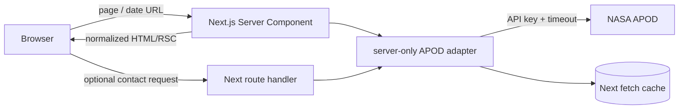

# Apogee — backend and data contract

## Boundary

The browser renders normalized entries and calls only our own origin for any client-requested data. `NASA_API_KEY` lives in server-only code and deployment secrets. External original/source links may open from the browser; the credentialed APOD endpoint must not.



## Normalized model

The UI consumes `Plate`, never the raw NASA response.

```ts
type Plate = {
  date: string
  title: string
  explanationText: string
  mediaType: 'image' | 'video' | 'other'
  imageUrl: string | null
  sourceUrl: string
  hdImageUrl: string | null
  alt: string
  creditText: string | null
}
```

The adapter accepts `unknown`, detects supported legacy/current shapes, strips markup to text where necessary, validates the date and HTTPS URLs, and returns a typed `Result`. It never pass-throughs `basic_html` or untrusted markup into React. `sourceUrl` must be a safe public source/permalink. `imageUrl` must be a real allowed image asset, never an article page.

Add `invalid_response`, `configuration` and `timeout` to the existing error union. Log only error kind/status/request id; never log the credentialed URL.

## Compatibility gate

Before coding the final adapter, save redacted fixtures from the actual endpoint for a recent image, historical image, video/iframe, small range and error response. Do not commit API keys or unnecessary HTML. If deployed shape differs from the repository's updated documentation, support only observed/documented shapes with explicit parsers; do not guess arbitrary fields.

## Request policy

- Prefer `X-Api-Key` header if the deployed APOD gateway supports it; otherwise query parameter remains inside server-only code. Confirm through live fixtures.
- Each upstream attempt has a 4-second abort timeout. Total operation budget is 12 seconds including backoff.
- Retry only network errors, timeouts, 429 and 5xx. Do not retry 400/403/404. Maximum three attempts.
- Parse `Retry-After` as seconds or HTTP date. Never retry earlier than requested. If the wait exceeds remaining request budget, return `rate_limited` with delay rather than sleeping past budget.
- Backoff without Retry-After: roughly 400ms then 800ms plus bounded jitter.

## Caching policy

Use Next's server fetch cache and prove it in production mode.

| Data | Proposed TTL | Reason |
|---|---:|---|
| Selected historical entry | 24 hours | Low churn, but editorial metadata can change |
| Current Eastern-date entry | 5 minutes | Publication/corrections can arrive late |
| Historical contact range | 24 hours | Same editorial caveat |
| Range containing current date | 5 minutes | Avoid pinning a late publication |

Only successful validated responses become usable data. Do not describe historical records as immutable. Cache evidence requires two identical production-mode requests with the second not consuming an upstream call, demonstrated using a mocked counter or safe rate-limit headers.

## Route handler contract

If the fixed contact sheet is entirely server-rendered, a public route handler is unnecessary and should be removed. If retained, it returns `{ data: { plates }, meta: { start, end } }` or `{ error: { code, title, detail } }`. Both dates are required, real, ordered, inside archive and limited to **8 inclusive days**. It accepts no target URL or API key input.

## Security and content rules

- `server-only` remains at adapter boundary.
- `.env.local` is ignored; `.env.example` explicitly unignored and placeholder-only.
- Secret scans print only match count/path, never the key.
- Remote hosts are narrowly allowlisted after fixtures reveal them.
- Never use `dangerouslySetInnerHTML` for upstream explanation/credit.
- Absent credit becomes “See source for image credit,” not “public domain.”
- Original source opens with `noopener noreferrer`.

## Failure contract

| Error | UI / operator action |
|---|---|
| `invalid_date` | Choose a real date |
| `out_of_range` | Show archive range |
| `not_found` | Offer adjacent dates |
| `rate_limited` | Explain busy archive and safe retry timing |
| `timeout` / `network` | Retry within bounded behaviour |
| `configuration` | Public generic message; operator checks env |
| `invalid_response` | Upstream changed/malformed; never show as empty |
| `upstream` | Generic public detail and server-side status log |

## Focused automated tests

- Parser fixtures for legacy/current image, video/other, markup removal, unsafe/missing URL and malformed range.
- Date validation: leap date, impossible date, archive start, future, Eastern date around UTC/local midnight.
- Retry: 400 once; 500 then success; 429 seconds; 429 HTTP-date; timeout; budget exhaustion.
- Route: missing params, 8 inclusive accepted, 9 rejected, reversed, impossible and out-of-range.
- Media lifecycle: URL change resets loading; failed URL followed by valid URL recovers.
