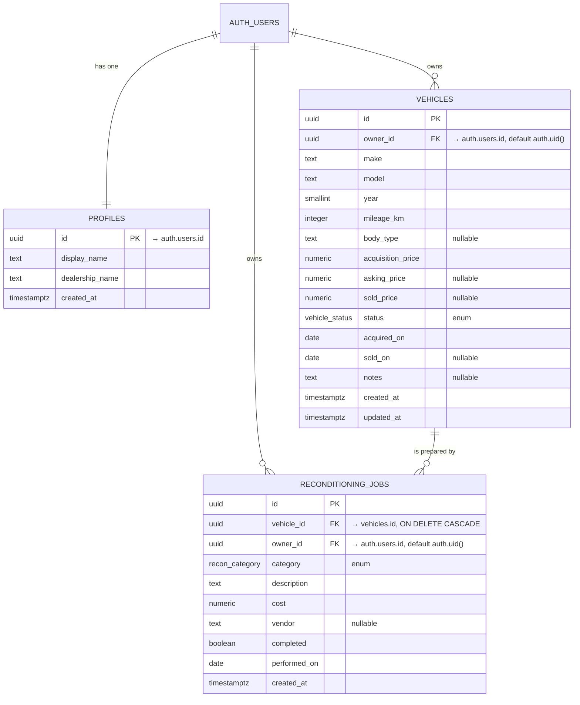

# 02 · Data Model

Satisfies brief doc requirement C2 ("full schema — a diagram is a nice touch").
This file is the source for the README's schema section.

---

## Entity relationship

**The relationship that matters:** one vehicle has many reconditioning jobs.
Deleting a vehicle cascades its jobs away, so orphaned costs cannot accumulate.

---

## Enums

| Type | Values | Purpose |
|---|---|---|
| `vehicle_status` | `sourcing` · `reconditioning` · `listed` · `sold` | Where the car is in the dealer's pipeline |
| `recon_category` | `mechanical` · `bodywork` · `detailing` · `tyres` · `electrical` · `paperwork` | The six buckets a dealer actually reports preparation spend in |

Enums rather than free text so the category chart can't be fragmented by typos
("Bodywork" vs "body work").

---

## Tables

### `profiles`
One row per user, created automatically by a trigger on signup.

| Column | Type | Notes |
|---|---|---|
| `id` | uuid PK | FK → `auth.users.id`, cascade on delete |
| `display_name` | text NOT NULL | Defaults to the email local-part |
| `dealership_name` | text NOT NULL | Shown in the header |
| `created_at` | timestamptz NOT NULL | |

### `vehicles` — main entity

| Column | Type | Notes |
|---|---|---|
| `id` | uuid PK | `gen_random_uuid()` |
| `owner_id` | uuid NOT NULL | **The RLS key.** Defaults to `auth.uid()` so the client never sets it |
| `make`, `model` | text NOT NULL | |
| `year` | smallint NOT NULL | CHECK 1950–2100 |
| `mileage_km` | integer NOT NULL | CHECK ≥ 0 |
| `body_type` | text NULL | |
| `acquisition_price` | numeric(12,2) NOT NULL | CHECK ≥ 0 |
| `asking_price` | numeric(12,2) NULL | |
| `sold_price` | numeric(12,2) NULL | |
| `status` | `vehicle_status` NOT NULL | default `sourcing` |
| `acquired_on` | date NOT NULL | default today |
| `sold_on` | date NULL | |
| `notes` | text NULL | |
| `created_at`, `updated_at` | timestamptz NOT NULL | `updated_at` maintained by trigger |

**Constraints that encode the business rule:**
- `sold_fields_consistent` — a car is `sold` only if it has **both** a sale price
  and a sale date; and a car that isn't sold must have neither. This stops the
  margin maths from silently going wrong.
- `sold_after_acquired` — a car cannot sell before it was bought.

### `reconditioning_jobs` — related entity

| Column | Type | Notes |
|---|---|---|
| `id` | uuid PK | |
| `vehicle_id` | uuid NOT NULL | FK → `vehicles.id` **ON DELETE CASCADE** |
| `owner_id` | uuid NOT NULL | default `auth.uid()` |
| `category` | `recon_category` NOT NULL | |
| `description` | text NOT NULL | |
| `cost` | numeric(12,2) NOT NULL | CHECK ≥ 0 |
| `vendor` | text NULL | |
| `completed` | boolean NOT NULL | default false |
| `performed_on` | date NOT NULL | default today |
| `created_at` | timestamptz NOT NULL | |

---

## Indexes

| Index | Columns | Reason |
|---|---|---|
| `vehicles_owner_status_idx` | `(owner_id, status)` | Every policy filters on `owner_id`; the list filters on status |
| `vehicles_owner_acquired_idx` | `(owner_id, acquired_on desc)` | Default list ordering |
| `recon_owner_vehicle_idx` | `(owner_id, vehicle_id)` | Jobs for one car, already scoped |
| `recon_vehicle_idx` | `(vehicle_id)` | The aggregate join in the view |

`owner_id` leads every composite index deliberately: the RLS predicate and the
query predicate are then satisfiable from one index.

---

## Row Level Security

RLS is enabled on all three tables. Policies are per-operation and grant to the
`authenticated` role only.

| Table | SELECT | INSERT | UPDATE | DELETE |
|---|---|---|---|---|
| `profiles` | own row | — (trigger) | own row | — |
| `vehicles` | `owner_id = auth.uid()` | `WITH CHECK owner_id = auth.uid()` | USING + WITH CHECK | `owner_id = auth.uid()` |
| `reconditioning_jobs` | `owner_id = auth.uid()` | `WITH CHECK` owner **and** parent vehicle owned by caller | USING + WITH CHECK | `owner_id = auth.uid()` |

**Three details worth defending in the interview:**

1. **USING vs WITH CHECK.** `USING` decides which existing rows an UPDATE may
   touch. `WITH CHECK` decides what they are allowed to become. Without the
   second, a user could update their own car and hand it to another `owner_id`.
2. **The nested EXISTS on job inserts.** Owning the job row isn't enough — the
   parent vehicle must also belong to the caller, or costs could be attached to a
   stranger's car.
3. **`(select auth.uid())` not `auth.uid()`.** The scalar subquery makes Postgres
   evaluate the function once per statement as an InitPlan instead of once per row.

---

## Derived data — computed in Postgres, not the browser

### View: `vehicle_economics`

Created `WITH (security_invoker = on)`.

> A Postgres view defaults to running with the privileges of whoever **created**
> it, which would bypass RLS entirely and leak every dealership's economics
> through this one object. `security_invoker` makes it run as the **caller**, so
> the table policies still apply. This single setting is the difference between a
> real boundary and a decorative one.

Per vehicle it returns: `recon_total`, `cost_basis` (acquisition + recon),
`realised_margin` (sold only), `projected_margin` (unsold, vs asking price), and
`days_in_stock`.

### Functions

| Function | Returns | Feeds |
|---|---|---|
| `dashboard_stats()` | fleet count, capital deployed, recon spend, realised margin, sold count, avg days in stock | The four KPI tiles |
| `monthly_performance(months_back int = 6)` | month, acquired count, sold count, realised margin | Charts 1 and 3 |
| `recon_by_category()` | category, total cost, job count | Chart 2 |

All three are `SECURITY INVOKER` and `STABLE`, so RLS scopes them to the caller.

### The one deliberate `SECURITY DEFINER`

`handle_new_user()` — the signup trigger. It must write a `profiles` row on behalf
of the auth system *before* the new user has a session, so it cannot run as the
caller. It is pinned with `SET search_path = ''` so a malicious schema on the
caller's path cannot hijack the unqualified names inside it.

---

## Realtime

`vehicles` and `reconditioning_jobs` are added to the `supabase_realtime`
publication. Realtime evaluates RLS before delivering, so a subscriber is only
sent changes to rows it could have read anyway.

---

## Storage buckets

**None.** File storage was scoped out; stated explicitly in the README so the
reviewer isn't left looking for a bucket that doesn't exist.
