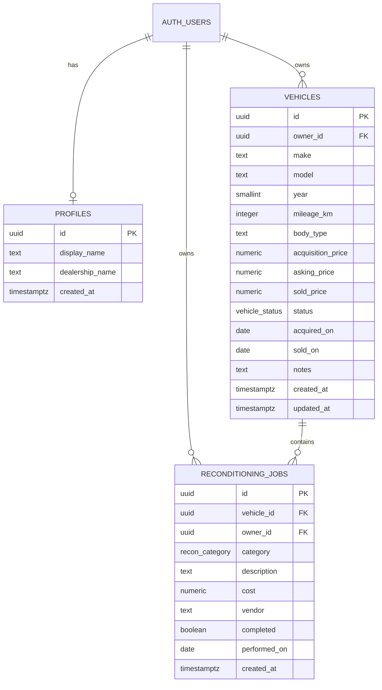

# 02 · Data model, metric contracts and integrity

Current source: 02-dashboard/supabase/migrations/0001_init.sql. This documents existing structure and explicitly marks planned tightening. Runtime schema parity must be checked separately.

## Relationships

Profile creation is triggered on auth-user insertion; verify pre-existing users also have profiles. User deletion cascades through owner FKs; vehicle deletion cascades jobs. UI must explain the latter before confirming.

## Complete field contract

| Table | Fields, types and defaults |
|---|---|
| profiles | id uuid PK/FK auth.users; display_name text NOT NULL default Dealer; dealership_name text NOT NULL default My Dealership; created_at timestamptz NOT NULL default now() |
| vehicles identity | id uuid PK default gen_random_uuid(); owner_id uuid NOT NULL FK auth.users default auth.uid(); make/model text NOT NULL |
| vehicles facts | year smallint NOT NULL, 1950–2100; mileage_km integer NOT NULL default 0, nonnegative; body_type text nullable; notes text nullable |
| vehicles money | acquisition_price numeric(12,2) NOT NULL, nonnegative; asking_price/sold_price numeric(12,2) nullable, nonnegative |
| vehicles lifecycle | status vehicle_status NOT NULL default sourcing; acquired_on date NOT NULL default current_date; sold_on date nullable; created_at/updated_at timestamptz NOT NULL default now() |
| jobs identity | id uuid PK default gen_random_uuid(); vehicle_id uuid NOT NULL FK vehicles ON DELETE CASCADE; owner_id uuid NOT NULL FK auth.users default auth.uid() |
| jobs facts | category recon_category NOT NULL; description text NOT NULL; cost numeric(12,2) NOT NULL nonnegative; vendor text nullable; completed boolean NOT NULL default false; performed_on date NOT NULL default current_date; created_at timestamptz NOT NULL default now() |

vehicle_status: sourcing, reconditioning, listed, sold.
recon_category: mechanical, bodywork, detailing, tyres, electrical, paperwork.

Existing sold_fields_consistent requires sold price/date exactly when sold. sold_after_acquired forbids a sale before acquisition. touch_updated_at() maintains vehicle modification time. handle_new_user() is a SECURITY DEFINER trigger with empty search_path and qualified table names.

## Planned validation tightening

- Shared bounds: make/model 1–80 trimmed characters; description 1–240; vendor/body_type up to 120; notes up to 2,000; profile display name 2–80 and dealership name 2–100.
- Required numeric fields must reject blank, nonfinite values and overflow, rather than coercing empty to zero. Money accepts at most two decimal places up to 9,999,999,999.99; zero is allowed explicitly.
- Validate real ISO calendar dates, not just nonempty strings; UI and server use the same year bounds. This version records acquired/completed transactions, so future acquisition/sale dates are rejected at write time.
- Establish Dubai business date explicitly for app and SQL date calculations; do not mutate the whole project's timezone as an undocumented side effect.
- Job recorded cost is included whether completed or pending. Completion is work status, not payment status. Label it “Recorded recon cost” rather than implying paid cash.
- Corrections to a sold car/job recalculate historical contribution. This is a disclosed mutable operational model, not an immutable accounting ledger.
- Same-owner parent integrity already exists in INSERT/UPDATE policies. Add a composite FK only if administrative writes need an additional structural guarantee; it is not necessary to redesign ownership for this assessment.

Implement DB-backed field bounds in a versioned migration; client validation alone is not a Data API boundary. Existing data must pass before adding constraints.

## Policies and privileges

Current public-table policy count is **10**, not 12.

| Table | SELECT | INSERT | UPDATE | DELETE |
|---|---|---|---|---|
| profiles | id = caller | trigger/admin only | id = caller before/after | no user policy |
| vehicles | owner = caller | owner = caller | owner = caller before/after | owner = caller |
| jobs | owner = caller | owner = caller AND parent owned | owner = caller AND resulting parent owned | owner = caller |

Owner defaults are convenience, not authorization. Attackers can send owner_id directly; RLS must reject it. Explicit USING/WITH CHECK is clear; PostgreSQL reuses USING if UPDATE's WITH CHECK is omitted.

Inventory grants as well as RLS: authenticated needs intended CRUD on vehicles/jobs, SELECT/UPDATE on profiles, SELECT on view and EXECUTE on the three analytics RPCs. Revoke public/anon RPC execution if not required; give no anonymous business-table access. Audit actual privileges rather than assuming project defaults. Keep helper trigger functions out of the public RPC surface where feasible.

The view is security_invoker, so caller policies apply. A view owned by an RLS-bypassing role can expose rows without that setting; do not generalize that every default view always leaks.

## Indexes

Current: vehicles(owner_id,status); vehicles(owner_id,acquired_on DESC); jobs(owner_id,vehicle_id); jobs(vehicle_id). They fit tenant/list/join queries at demo scale. Add indexes only after an actual query need; no speculative search engine.

## Metric definitions — one source of meaning

| Value | Formula and scope |
|---|---|
| recon_total | Sum of all recorded job costs for the vehicle, including pending jobs; empty sum = 0 |
| cost_basis | acquisition_price + recon_total |
| projected_margin | asking_price − cost_basis for unsold stock; NULL if no asking price |
| realised_margin | sold_price − cost_basis for sold vehicles; NULL otherwise |
| days_in_stock | Sold date minus acquired date if sold; Dubai business date minus acquired date otherwise |
| fleet_count | Unsold vehicles count |
| capital_deployed | Sum cost_basis of unsold vehicles; label “Stock cost basis” or explain recorded-cost definition |
| recon_spend_total | All-time recorded job cost, sold and unsold vehicles |
| realised_margin_total | All-time sold contribution before overheads |
| sold_count | All-time sold count |
| avg_days_in_stock | Mean days of unsold stock; UI shows “No stock” when fleet_count = 0, not a misleading performance zero |

dashboard_stats() returns **one table row as an API array** unless .single() is requested. Validate exactly one object with finite numeric values. Never silence a failed response by inventing zeros.

monthly_performance(6) returns six calendar buckets including current month, using acquired_on for bought and sold_on for sold. Bought/sold are separately grouped before the month-series join; this source fix must be retained. Bound months_back to 1–24, with explicit NULL handling. Empty months have zero counts/margin. A month with sales and zero net margin is not empty.

recon_by_category() returns category, total_cost, job_count; retain zero-cost categories with jobs. Both its sum and the KPI cover all time. Month chart heading explicitly states its narrower window.

vehicle_economics is read-only derived data. It currently returns identity/owner, make/model/year, mileage/body_type/notes, status/acquisition/sale dates/prices and five derived fields. SQL numeric owns arithmetic; normalize API values at the server boundary and retain cents in detail/table output.

## Fixtures for later independent checks

Existing A seed, if unmodified: 10 vehicles, 5 unsold, 5 sold, 10 jobs; B: 2 vehicles and **no jobs**. Proposed proof seed must add B jobs and an empty third account.

For current A financial values:
- Unsold cost basis: 195,800 + 151,600 + 195,000 + 118,000 + 64,150 = **AED 724,550**.
- Recorded recon: 10,800 + 6,600 + 4,700 + 6,150 = **AED 28,250**.
- Sold margin: 17,300 + 34,000 + 13,000 + 13,000 + 15,000 = **AED 92,300**.
- Category totals: mechanical 13,100; tyres 4,800; detailing 4,400; bodywork 4,200; paperwork 950; electrical 800.

These are hand-calculated expectations from source, not a live DB result. Age varies with seed anchor date. At the screenshot's 2026-09-20 anchor, the five unsold ages sum to 265 (mean 53 days), assuming matching seed dates.

Separate tiny regression fixture: two acquisitions in one month, three sales of older vehicles in that month with contributions +100, −50 and 0 → bought 2, sold 3, contribution 50. Test month start/end, year boundary, missing target, no jobs, zero-cost jobs and losses.

## Optional realtime / unused services

See 03 for the authorization decision. Base-table publication is not a blanket guarantee of delete-event isolation. No Storage bucket or Edge Function is used. Profile editing adds no table or upload service.
