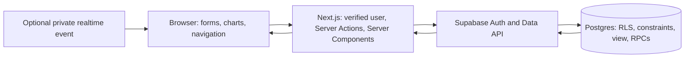

# 03 · Architecture and behavior contracts

Keep the current small architecture. The improvement is explicit contracts and safe failure behavior, not more infrastructure.

## Decisions and trade-offs

| Decision | Chosen approach | Alternative/trade-off |
|---|---|---|
| Backend | Supabase SQL/Auth | Convex/Appwrite valid; SQL matches this schema and aggregation |
| Reads | Request-scoped Server Components/client; parallel independent queries | Client query cache adds complexity not needed here |
| Writes | Server Actions with validation, verified identity and DB RLS | Route handlers add an API layer without a current consumer |
| Feedback | Explicit pending/result/error; preserve input | Full optimistic CRUD risks reconciliation and false success |
| Analytics | Caller-scoped view + three RPCs | Client summation downloads rows and duplicates business definitions |
| Types | Generated Database type where available + focused runtime validation | Existing unchecked casts concealed the KPI bug |
| Account | profiles is source of display/dealership names | Duplicating editable names in auth metadata risks stale header values |
| Scale | Small dataset; bounded list or honest cap | Cursor pagination is later, not an unlimited-load promise |

Do not describe Recharts as small without measurement. Do not promise flat database work just because aggregate response payload is small.

## Read boundary

Create focused getOverview/getInventory/getVehicle functions only where they remove duplicated parsing/error handling. They use a fresh cookie-bound public-key client for each request; no service-role client in runtime code.

For dashboard_stats, request .single() then validate the response. A missing field/row or nonfinite value is a contract error. Return typed data or a deliberate error, never an as-cast and hope.

Check every Supabase error. If an analytics panel fails, show that panel unavailable with Retry while retaining separately successful panels; a simpler route-level retry is acceptable. Missing/forbidden vehicle with a successful query becomes notFound; backend failure does not. A genuinely empty account shows actions, never an indefinite skeleton.

Private HTML/data/session responses must not enter shared ISR/CDN caches. Never cache user-bound query results globally without an explicit user key. Keep authorization on direct action entry points, not only layout/middleware.

## Mutation contract

1. Verify identity with getUser (current approach) or verified claims as appropriate; never trust an unvalidated cookie payload.
2. Parse allowlisted business fields, UUIDs, strict money and dates. Reject blank required amounts and unexpected identities.
3. Perform operation as the user. For update/delete, request returned rows or an exact count and require the intended affected row.
4. Map known validation/constraint errors to field/action messages; unexpected server diagnostics stay in redacted server logs.
5. Revalidate overview, inventory and affected detail after cost/status changes. Derive affected vehicle from returned job data, not only a hidden caller field.
6. Return one serializable result shape: success, fieldErrors, formError and optional recordId. Close/redirect only after actual success.

Pending buttons prevent accidental double submit; they are not a database idempotency guarantee. Do not automatically retry an uncertain POST and duplicate a car/job. Explain “Save status unknown; check inventory before retrying” if necessary.

Add updateReconJob for all editable fields. Completion sends a desired boolean, not a claimed atomic toggle. Existing last-writer-wins is acceptable if disclosed; warn that a second tab's stale form can overwrite changes. Version checks are future work unless time remains.

Move EMPTY_FORM_STATE out of the file-wide use-server module. Reuse a lightweight dialog and field-error primitive; avoid introducing a form/state framework solely for these fixes.

## Profile editing — user-requested

Route /settings, linked from an account menu in the header. Fields: display name, dealership name; email read-only. No avatar upload, role editor, team management or email-change promise.

Server action ignores submitted user ID: verified user.id scopes profiles.update(...).eq('id', user.id).select(...).single(). Validate display name 2–80, dealership 2–100 trimmed characters. RLS remains the cross-user boundary. Missing profile is an explicit provisioning error, not a silent saved state.

Save/Cancel, dirty-state indication, pending lock, inline error and success notice; do not disable Cancel forever after failure. Revalidate app layout so the header updates immediately. Confirm reload and a second login retain the change. Keep profile data separate from access-control claims.

## Login/session quality

- Keep email/password sign-in. Add show/hide password with accessible pressed state and clear labels.
- Separate keyed sign-in/sign-up form instances so password/defaults/error state cannot leak across modes.
- Demo-access guidance must match actual setup; remove claims that blank fields are prefilled.
- Usernames/passwords for proof/seed come from one local env convention. No password in browser-prefixed env or source.
- Wrong credentials use a generic message; network/service outage and rate limit need useful distinct retry guidance without account enumeration.
- If public signup stays visible, verify email-confirmation-on and -off outcomes and the actual callback route. Otherwise hide signup and use preconfirmed reviewer users; do not ship a dead flow.
- Password reset is optional beyond the brief. Add a link only alongside a tested email/callback/new-password flow. For this time-box, profile names are more valuable than speculative OAuth/2FA.
- Preserve refreshed cookies when returning redirects; getUser currently verifies via Auth and is valid. The middleware→proxy rename is maintenance, not proof of a current auth bypass.
- Authenticated layout and actions independently check user. Support only allowlisted relative return paths; never redirect to arbitrary user-supplied URLs.
- Handle sign-out failure and clear private view state; verify expiry, sign-out/back navigation and A→B switching.

## Realtime retention decision

Current wildcard Postgres Changes subscriptions refresh on every event. Supabase's deleted-record delivery has different authorization semantics; an owner filter in this client is not itself a security boundary against another subscriber. A green Live label proves subscription state, not correct/successful data refresh.

**Core-safe fallback:** remove subscription and these tables from the publication if dropping realtime. Keep explicit mutation revalidation and manual refresh. Do not leave an exposed event surface while only hiding its badge.

**If retaining within budget:** use owner-scoped private Broadcast channels for insert/update/delete. Trigger chooses topic from actual NEW/OLD owner, not browser input; client receive policy allows only topic matching auth.uid(), and client send is denied unless required. Minimize event payload to an invalidation signal. Lock down helper privileges/search_path. Remove unneeded base-table Postgres Changes publication entries without changing unrelated tables.

Use 200–300ms coalescing of event refreshes, refresh once after reconnection, cleanup on unmount/sign-out, resubscribe after identity change. Do not discard dirty forms. Indicate Connecting / Live / Reconnecting / Unavailable; preserve last data and expose Refresh. Prove A cannot join B's topic, including malicious direct subscriptions and deletes.

This is more work than the current subscriber: cut realtime before compromising core delivery. Guidance: [Broadcast database events](https://supabase.com/docs/guides/realtime/subscribing-to-database-changes), [channel authorization](https://supabase.com/docs/guides/realtime/authorization).

## Failure contract

| Condition | Visible outcome |
|---|---|
| Pending read | Geometry-matched skeleton, not fake data |
| Empty success | Useful next action; KPI empty semantics |
| Failed query | Unavailable/Retry, no fake zero or no-stock claim |
| Invalid form | Preserve values, field errors and focused summary |
| Zero-row update/delete | Record missing/no longer editable; no success |
| Deletion with jobs | Named confirmation with child count; success navigates away |
| Lost socket | Last data + reconnect state; ordinary reads/writes still determine success |
| Auth expired | Session-expired login route; no stale tenant data |
| Unexpected error | Safe message/digest; never assert “data is safe, display issue” without evidence |
